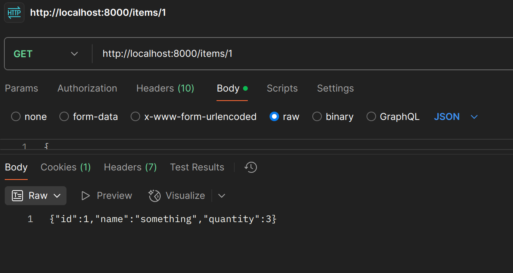

# 🚀 Codechef Inventory Management
**Project made as part of the recruitment process for Codechef.**
- (skipped a lab to make this work T_T )

## To reproduce on your machine:
1. Clone the repo
```
$ git clone https://github.com/sofaspawn/codechef-inventory-management/
```
2. Change the working directory
```
$ cd codechef-inventory-management
```
3. Compile and run the release binary
```
$ cargo run --release
```

## 🛠️ Technologies Used
- **Language**: Rust 🦀
- **Framework**: Rocket 🚀
- **Database**: In-Memory (Planned: Persistent Database)

## 📌 Features
✅ **Inventory Management**
- Retrieve all items in the inventory (JSON format).
- Add new items to the inventory.
- Prevent duplicate items before adding them.
- Update or delete items in your inventory.

✅ **User Authentication**
- Secure, session-based authentication.
- Passwords are securely hashed using **bcrypt**.

✅ **User Experience Enhancements**
- Authorization required for inventory actions.
- Seamless login/logout with cookies.

## 📜 API Endpoints
| Method | Endpoint             | Description |
|--------|----------------------|-------------|
| `POST` | `/signup`            | Register a new user |
| `POST` | `/login`             | Authenticate a user |
| `GET`  | `/logout`            | Log out a user |
| `GET`  | `/whoami`            | Get logged-in user info |
| `GET`  | `/items`             | Fetch all inventory items |
| `GET`  | `/items/<id>`        | Retrieve item by ID |
| `POST` | `/items`             | Add a new item |
| `PUT`  | `/items/update/<id>` | Update an item by ID |
| `PUT`  | `/items/delete/<id>` | Remove an item by ID |

## ✅ Completed Tasks
- [x] Implement user sign-up and login (**Session-Based Auth**).
- [x] Authenticate & test API using **Postman**.
- [x] Implement **CRUD operations** for inventory items.
- [x] Secure password hashing with **bcrypt**.

## 🚀 Upcoming Enhancements
- [ ] **Integrate a persistent database** 🗃️ *(Planned: PostgreSQL)*
- [ ] **Implement fuzzy searching for items** 🔍 *(If time permits)*
- [ ] **Rate Limiting Middleware** ⏳ *(If time permits)*  

## 📸 Proof-of-Work ScreenShots (Postman):

<div align="center">  
  <table>  
    <tr>  
      <td></td>  
      <td></td>  
    </tr>  
    <tr align="center">  
      <td><b>Signup Endpoint</b></td>  
      <td><b>Login Endpoint</b></td>  
    </tr>  
    <tr>  
      <td></td>  
      <td></td>  
    </tr>  
    <tr align="center">  
      <td><b>Fetching Inventory</b></td>  
      <td><b>Fetching an Item with ID</b></td>  
    </tr>  
    <tr>  
      <td></td>  
      <td></td>  
    </tr>  
    <tr align="center">  
      <td><b>Adding new items</b></td>  
      <td><b>Updating existing items</b></td>  
    </tr>  
    <tr>  
      <td></td>  
    </tr>  
    <tr align="center">  
      <td><b>Deleting items with ID</b></td>  
    </tr>  
  </table>  
</div>  

